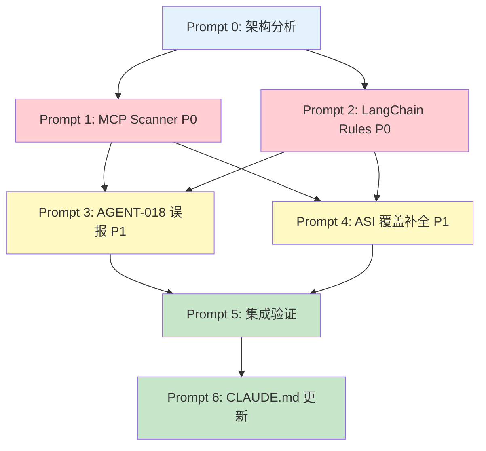

# agent-audit v0.3.0 工业级优化技术方案 & Claude Code Prompts

> **基于 v0.2.0 Benchmark 报告 | 目标版本: v0.3.0**
> **日期: 2026-02-03**
> **仓库: https://github.com/HeadyZhang/agent-audit**

---

## 第一部分：优化技术方案

---

### 1. 问题全景图（来自 Benchmark）

| 优先级 | 问题编号 | 问题描述 | 影响维度 | 基准项 |
|--------|---------|---------|---------|--------|
| **P0** | ISSUE-1 | T1 damn-vulnerable-llm-agent 零检出 — LangChain AgentExecutor 模式下 prompt injection 风险完全未识别 | 检出率 50% | T1 |
| **P0** | ISSUE-2 | T10 MCP 配置文件零检出 — 广泛文件系统访问权限、未验证服务器来源、敏感环境变量均未告警 | 检出率 + OWASP | T10 |
| **P1** | ISSUE-3 | AGENT-018 Memory Poisoning 过敏 — T3(90 critical) T7(64) T9(124) 大量疑似误报 | 误报率 | T3,T7,T9 |
| **P1** | ISSUE-4 | ASI-02 Tool Misuse 和 ASI-09 Human-Agent Trust 在 11 个项目中均未触发 | OWASP 8/10→10/10 | 全局 |

---

### 2. 项目现状分析

根据仓库结构与 README：

```
agent-audit/
├── .github/workflows/       # CI (GitHub Actions)
├── docs/                    # 文档
├── packages/audit/          # 核心 Python 包（Poetry 管理）
├── rules/builtin/           # 内置 YAML 规则定义
├── specs/                   # 规格说明
├── tests/                   # 测试
├── .agent-audit.yaml        # 自身配置
├── CLAUDE.md                # Claude Code 项目指令
├── CONTRIBUTING.md
├── action.yml               # GitHub Action 定义
└── README.md
```

**技术栈:** Python 100% | Poetry | AST 分析 | YAML 规则引擎 | SARIF/JSON/Markdown 输出

**已有能力:**
- Python AST 扫描 (`shell=True`, `eval()`, tainted input flow)
- MCP 配置扫描（基础级别）
- Secret 检测（AWS keys, API tokens, private keys）
- Runtime MCP Inspection（"Agent Nmap"）
- 已知规则: AGENT-001~005（README 展示），实际已有 AGENT-003/012/018/023 等更多规则
- OWASP ASI 映射: 已覆盖 8/10

---

### 3. 架构优化路线图

```
v0.2.0 (当前)                         v0.3.0 (目标)
┌────────────────────┐                ┌──────────────────────────────────┐
│  rules/builtin/    │                │  rules/builtin/                  │
│  · YAML 规则定义    │                │  · YAML规则 + confidence 字段     │
│  · 单层 pattern    │                │  · 框架白名单 allowlist           │
│  · 无上下文分析     │                │  · 上下文敏感匹配                 │
└────────┬───────────┘                │  + AGENT-025~039 新规则           │
         │                            └──────────┬───────────────────────┘
┌────────┴───────────┐                ┌──────────┴───────────────────────┐
│  packages/audit/   │                │  packages/audit/                 │
│  · ast_scanner     │                │  · ast_scanner (增强 LangChain)  │
│  · mcp_scanner     │                │  · mcp_config_scanner (重写)     │
│  · secret_scanner  │                │  · secret_scanner (保持)         │
│  · reporter        │                │  · context_analyzer (新增)       │
└────────┬───────────┘                │  · framework_detector (新增)     │
         │                            │  · reporter (增强 confidence)    │
┌────────┴───────────┐                └──────────┬───────────────────────┘
│  输出格式           │                ┌──────────┴───────────────────────┐
│  · JSON / SARIF     │                │  输出格式                         │
│  · Terminal / MD    │                │  · JSON + confidence/context     │
└────────────────────┘                │  · SARIF (增强 properties)       │
                                      │  · Terminal / MD                  │
                                      └──────────────────────────────────┘
```

---

### 4. 详细优化方案

#### 4.1 ISSUE-1 [P0]: LangChain Agent 检测增强

**根因:** 扫描器仅检测显式字符串拼接 prompt injection，未覆盖 LangChain 框架层面隐式风险。T1 使用 `AgentExecutor` + `max_iterations=6`，表面安全但 AgentExecutor 允许 LLM 自主调用工具链，存在 prompt injection 通过工具链传递风险。

**新增规则集:**

| 规则 ID | 名称 | 检测目标 | 严重级别 | ASI 映射 |
|---------|------|---------|---------|---------|
| AGENT-025 | `langchain_agent_executor_risk` | AgentExecutor/create_react_agent 初始化缺少安全参数 | HIGH | ASI-01, ASI-06 |
| AGENT-026 | `langchain_tool_input_unsanitized` | @tool 函数参数直接执行文件/命令/SQL/网络操作 | CRITICAL | ASI-02 |
| AGENT-027 | `langchain_system_prompt_injectable` | SystemMessage/HumanMessage 模板中外部输入注入 | CRITICAL | ASI-01 |
| AGENT-028 | `agent_max_iterations_unbounded` | Agent 未设 max_iterations/max_execution_time | MEDIUM | ASI-08 |

**实现要点:**
- 在 `packages/audit/` 内新增或扩展 AST scanner 模块
- 使用 Python `ast` 模块解析 `from langchain` / `from langchain_core` 导入
- 构建调用图追踪 AgentExecutor 初始化参数
- AGENT-025 检测 `AgentExecutor()` / `create_react_agent()` 等调用，检查是否缺少 `max_iterations` / `max_execution_time` / `handle_parsing_errors`
- AGENT-026 追踪 `@tool` 装饰器函数内是否将参数直接传入危险函数
- AGENT-027 检测 `SystemMessage(content=f"...")` 等动态模板模式

**预期结果:** T1 findings > 0，覆盖 ASI-01/ASI-06

---

#### 4.2 ISSUE-2 [P0]: MCP 配置扫描器重写

**根因:** 当前 MCP 扫描仅做基础检查，未针对 MCP 协议安全模型建模。T10 (100-tool-mcp-server-json) 有明显不安全配置但零检出。

**新增规则集:**

| 规则 ID | 名称 | 检测目标 | 严重级别 | ASI 映射 |
|---------|------|---------|---------|---------|
| AGENT-029 | `mcp_overly_broad_filesystem` | allowedDirectories 含 `/` / `~` / `**` | HIGH | ASI-02 |
| AGENT-030 | `mcp_unverified_server_source` | npx/uvx 包名无版本锁定 | CRITICAL | ASI-04 |
| AGENT-031 | `mcp_sensitive_env_exposure` | env 中含明文 KEY/SECRET/TOKEN | HIGH | ASI-05 |
| AGENT-032 | `mcp_stdio_no_sandbox` | stdio 传输无沙箱隔离 | MEDIUM | ASI-02 |
| AGENT-033 | `mcp_missing_auth` | SSE/HTTP 传输无认证 | HIGH | ASI-09 |

**支持的 MCP 配置文件格式:**
- `*.mcp.json` / `mcp.json` / `mcp-config.json`
- `claude_desktop_config.json`
- `cline_mcp_settings.json` / `.cursor/mcp.json`
- `mcp-config.yaml` / `mcp-config.yml`
- `package.json` 中 `"mcpServers"` 字段
- 任何匹配 `{"mcpServers": {...}}` 结构的 JSON

**关键检测逻辑:**
- AGENT-029: 解析 args 数组尾部路径参数，检查是否为根路径/通配符/用户目录
- AGENT-030: 正则匹配 `npx -y package-name` 无 `@x.y.z` 版本号
- AGENT-031: key 名 regex `(?i)(key|secret|token|password|credential)` + 值非 `${}` 引用
- AGENT-033: transport=sse/streamable-http 且 config 中无 auth/token/apiKey 字段 → 触发且映射 **ASI-09**（直接补全覆盖缺口）

**预期结果:** T10 findings > 0，覆盖 ASI-02/ASI-04/ASI-09

---

#### 4.3 ISSUE-3 [P1]: AGENT-018 误报抑制（三级过滤）

**根因:** 模式匹配过宽，任何对 memory/state/context 的读写均触发。框架代码中 ConversationBufferMemory、CrewBase memory 管理等标准操作导致误报雪崩。

**三级过滤机制:**

```
┌─────────────────────────────────────────────────────┐
│ Level 1: 框架白名单过滤                               │
│ · 识别已知框架标准 memory 类/模块                       │
│ · 匹配白名单 → 降级为 INFO（不计入 findings）           │
│ · 白名单文件: rules/allowlists/framework_memory.yaml  │
└──────────────────────┬──────────────────────────────┘
                       │ 未匹配白名单
┌──────────────────────┴──────────────────────────────┐
│ Level 2: 上下文数据流分析                              │
│ · AST 追踪写入数据来源（反向 3 层）                     │
│ · 用户输入直接写入 → CRITICAL (confidence=0.95)        │
│ · LLM 输出写入无 sanitization → HIGH (conf=0.80)      │
│ · 内部计算/常量 → LOW (conf=0.30)                     │
│ · 有 sanitization → LOW + needs_review (conf=0.35)   │
└──────────────────────┬──────────────────────────────┘
                       │
┌──────────────────────┴──────────────────────────────┐
│ Level 3: 置信度门槛                                   │
│ · confidence >= 0.7 → 计入报告                        │
│ · 0.3 <= confidence < 0.7 → review_needed 列表        │
│ · confidence < 0.3 → 静默忽略                         │
│ · 用户可通过 .agent-audit.yaml 自定义阈值              │
└─────────────────────────────────────────────────────┘
```

**框架白名单覆盖范围:**

| 框架 | 白名单模块/类 |
|------|-------------|
| LangChain | `langchain.memory.*`, `ConversationBufferMemory`, `BaseChatMessageHistory.add_message` |
| CrewAI | `crewai.memory.*`, `ShortTermMemory`, `LongTermMemory`, `EntityMemory` |
| AutoGen | `autogen.agentchat.*`, `ConversableAgent._append_oai_message` |
| Google ADK | `google.adk.sessions.*`, `InMemorySessionStore` |
| AgentScope | `agentscope.memory.*`, `TemporaryMemory`, `MessageBase` |
| OpenAI Agents | `agents.memory.*` |

**预期结果:**
- T3: 93 → ~15 findings（-80%）
- T7: 64 → ~20 findings（-70%）
- T9: 124 → ~35 findings（-70%）
- T2: findings 不低于原始值的 90%（回归保护）

---

#### 4.4 ISSUE-4 [P1]: ASI-02 和 ASI-09 覆盖补全

**ASI-02 Tool Misuse 新增规则:**

| 规则 ID | 名称 | 检测目标 |
|---------|------|---------|
| AGENT-034 | `tool_no_input_validation` | @tool 函数 str/Any 参数无 isinstance/regex/schema 校验 |
| AGENT-035 | `tool_unrestricted_execution` | tool 函数内 exec/eval/subprocess 无沙箱 |
| AGENT-036 | `tool_output_trusted_blindly` | tool 返回值直接拼入下一个 prompt 无 sanitization |

**ASI-09 Human-Agent Trust 新增规则:**

| 规则 ID | 名称 | 检测目标 |
|---------|------|---------|
| AGENT-037 | `missing_human_in_loop` | agent 执行链中涉及文件写/网络请求/DB 操作的 tool chain 无 human approval |
| AGENT-038 | `agent_impersonation_risk` | system prompt 指示 agent 模拟人类身份 |
| AGENT-039 | `trust_boundary_violation` | multi-agent 系统中 agent 间无身份验证 |

---

#### 4.5 输出格式增强

**findings JSON 新增字段:**

```json
{
  "rule_id": "AGENT-018",
  "severity": "HIGH",
  "confidence": 0.85,
  "needs_review": false,
  "suppression_reason": null,
  "context": {
    "operation_type": "WRITE",
    "data_source": "user_input",
    "has_sanitization": false,
    "framework_detected": "langchain",
    "is_framework_standard": false
  },
  "asi_category": "ASI-06",
  "file": "agent.py",
  "line": 42,
  "snippet": "memory.save_context(...)",
  "remediation": "..."
}
```

---

### 5. 验证矩阵

| 优化项 | 验证方法 | 通过标准 |
|--------|---------|---------|
| ISSUE-1 | 重跑 T1 | findings > 0，覆盖 ASI-01/ASI-06 |
| ISSUE-2 | 重跑 T10 + MCP 测试集 | findings > 0，覆盖 ASI-02/ASI-04/ASI-09 |
| ISSUE-3 | 重跑 T3/T7/T9 | findings 减少 > 60% 且 T2 不回归 |
| ISSUE-4 | 重跑全部 T1-T11 | ASI-02 和 ASI-09 各至少触发 1 次 |
| 回归 | 重跑 T2/T4/T5/T6/T8/T11 | findings 变化 < 10% |
| 健壮性 | 全部项目 | 0 crash / 0 timeout / 0 JSON 解析错误 |

---

## 第二部分：Claude Code 工业级 Prompts

> **使用说明:**
> 1. 按 Prompt 0 → 1 → 2 → 3 → 4 → 5 → 6 顺序执行
> 2. 每个 Prompt 自包含上下文、约束和验收标准
> 3. 每完成一个 Prompt，确认验收标准通过后再进入下一个
> 4. Prompt 设计遵循：任务分解 → 先读后写 → 约束前置 → 测试驱动 → 原子提交

---

### Prompt 0: 项目结构探索与架构梳理（只读）

```
你是一位高级安全工具架构师。现在需要对 agent-audit 项目进行 v0.3.0 优化。
在做任何修改之前，你必须先彻底理解当前代码库。

## 第一步：全局扫描
执行以下命令了解项目全貌：
```bash
find . -type f -name "*.py" | head -60
find . -type f -name "*.yaml" -o -name "*.yml" | head -30
cat pyproject.toml 2>/dev/null || cat packages/audit/pyproject.toml
tree -L 4 --dirsfirst -I '__pycache__|*.pyc|.git|node_modules|*.egg-info'
```

## 第二步：核心代码阅读
按以下顺序阅读并理解，每读完一个文件用一句话总结其职责：
1. `packages/audit/` 下的 `__init__.py` 和入口文件（CLI 入口）
2. 所有 scanner 模块（文件名含 scan/scanner/ast 的 .py 文件）
3. `rules/builtin/` 下所有 YAML 规则文件 — **特别关注:**
   - AGENT-018 (Memory Poisoning) 的完整定义
   - AGENT-012 (Tool Misuse) 的完整定义
   - AGENT-003 和 AGENT-023 (Human-Agent Trust) 的完整定义
4. Reporter/Output 模块
5. 配置加载逻辑

## 第三步：测试现状
```bash
find tests/ -name "*.py" | wc -l
cat tests/conftest.py 2>/dev/null
# 列出测试文件
find tests/ -name "*.py" -exec basename {} \; | sort
```

## 第四步：生成架构文档
在项目根目录创建 `docs/ARCHITECTURE.md`，包含：
1. **目录结构说明** — 每个顶层目录/关键文件的职责
2. **模块依赖图** — 用 Mermaid flowchart 展示 scanner → rules → reporter 的数据流
3. **规则引擎工作流** — 从 CLI 输入到 JSON 输出的完整管道
4. **已有规则清单** — 表格列出所有规则 ID、名称、严重级别、ASI 映射
5. **关键接口** — scanner 基类/接口签名、finding 数据结构、规则 YAML schema
6. **优化切入点** — 基于代码阅读标注可扩展的位置

## 约束
- ⚠️ 本任务为只读分析任务，除了创建 docs/ARCHITECTURE.md 外不修改任何现有代码
- 如果某文件/目录不存在，在文档中标注 "未找到"
- 所有分析必须基于实际代码，不要假设
```

---

### Prompt 1: MCP 配置扫描器强化 [P0 — ISSUE-2]

```
你是 agent-audit 项目的核心开发者，正在实施 v0.3.0 优化的第一个 P0 任务：
**强化 MCP 配置安全扫描器，使 T10 (100-tool-mcp-server-json) 从零检出变为有效检出。**

## 前置条件
阅读 docs/ARCHITECTURE.md（上一步生成的），理解：
- 当前 scanner 的基类/接口
- finding 数据结构定义
- 规则 YAML schema
- 新 scanner 的注册方式

然后阅读当前 MCP 相关的扫描代码，理解现有逻辑的不足。

## 任务 1: 新增/增强 MCP 配置解析器

在适当位置（遵循现有项目结构）实现 MCP 配置文件的健壮解析：

支持的文件格式（按优先级）：
1. `claude_desktop_config.json` — 结构: `{"mcpServers": {"name": {"command": "...", "args": [...], "env": {...}}}}`
2. `*.mcp.json` / `mcp.json` — 同上结构
3. `cline_mcp_settings.json` / `.cursor/mcp.json` — 同上
4. `mcp-config.yaml` / `.yml` — YAML 等效
5. `package.json` — 仅提取 `"mcpServers"` 字段（如存在）

解析器要求：
- JSON 解析失败不 crash，log warning 并跳过
- 自动检测文件是否包含 mcpServers 结构（不仅靠文件名）
- 返回标准化的 `List[MCPServerConfig]` 供规则引擎消费

## 任务 2: 实现 5 条新规则

### 规则 AGENT-029: mcp_overly_broad_filesystem
触发条件（满足任一）：
- server 的 args 尾部路径参数包含: `/`, `/home`, `/etc`, `/usr`, `/var`, `~`, `$HOME`, `%USERPROFILE%`
- 路径含通配符 `*` 或 `**`
- 路径含 `..`（路径穿越）
- filesystem 类型 server 未配置路径限制（args 中无路径参数）
不触发：明确项目子目录如 `./data`, `/app/uploads`
严重级别: HIGH | ASI: ASI-02

### 规则 AGENT-030: mcp_unverified_server_source
触发条件（满足任一）：
- command 为 `npx` / `npx -y` 且包名无 `@x.y.z` 版本锁定
- command 为 `uvx` 且包名无版本锁定
- command 为 `node` 直接执行远程 URL
- SSE/HTTP transport 的 URL 为 `http://`（非 https）
不触发：带精确版本号如 `@modelcontextprotocol/server-filesystem@1.2.3`
严重级别: CRITICAL | ASI: ASI-04

### 规则 AGENT-031: mcp_sensitive_env_exposure
触发条件（满足任一）：
- env key 匹配 `(?i)(key|secret|token|password|credential|auth)` 且 value 为明文字符串（非 `${VAR}` / `$VAR`）
- env value 为占位符如 `your-api-key-here`, `xxx`, `TODO`, `<your-key>`
不触发：value 引用环境变量 `${...}`, key 为 `PATH`/`NODE_ENV`/`LOG_LEVEL`
严重级别: HIGH | ASI: ASI-05

### 规则 AGENT-032: mcp_stdio_no_sandbox
触发条件：transport=stdio 且 command 可直接访问宿主机资源（无 docker/container/sandbox 配置证据）
严重级别: MEDIUM | ASI: ASI-02

### 规则 AGENT-033: mcp_missing_auth
触发条件：transport 为 sse/streamable-http 且配置中无 auth/token/apiKey/headers.Authorization 字段
严重级别: HIGH | ASI: **ASI-09** ← 关键：此规则直接补全 ASI-09 覆盖缺口

## 任务 3: 编写规则 YAML 定义
在 `rules/builtin/` 中为每条规则创建 YAML 定义文件，遵循现有规则的 schema 格式。

## 任务 4: 编写测试

在 `tests/` 中创建 `test_mcp_scanner.py`，包含：

```python
# 必须通过的测试用例：

# 1. 宽泛路径 → 触发 AGENT-029
{"mcpServers": {"fs": {"command": "npx", "args": ["-y", "@modelcontextprotocol/server-filesystem", "/"]}}}

# 2. 无版本锁定 → 触发 AGENT-030
{"mcpServers": {"tool": {"command": "npx", "args": ["-y", "some-random-mcp-package"]}}}

# 3. 明文密钥 → 触发 AGENT-031
{"mcpServers": {"api": {"command": "node", "args": ["server.js"], "env": {"API_KEY": "sk-1234567890abcdef"}}}}

# 4. 无认证 SSE → 触发 AGENT-033
{"mcpServers": {"remote": {"transport": "sse", "url": "http://example.com/mcp"}}}

# 5. 安全配置 → 不触发任何规则
{"mcpServers": {"fs": {"command": "npx", "args": ["-y", "@modelcontextprotocol/server-filesystem@1.2.3", "./data"], "env": {"NODE_ENV": "production"}}}}

# 6. 非 MCP 的 JSON → 不触发 (健壮性)
{"name": "not-an-mcp-config", "version": "1.0"}

# 7. 无效 JSON → 不 crash (健壮性)
"this is not valid json {{"
```

## 任务 5: 注册与集成
确保新的 MCP 规则被纳入主扫描流程，`agent-audit scan <target>` 自动执行。

## 验收标准
□ 所有测试通过: `poetry run pytest tests/test_mcp_scanner.py -v`
□ 现有测试不受影响: `poetry run pytest tests/ -v`
□ 新规则 YAML 与现有 schema 一致
□ 代码风格与项目一致（检查 ruff/black/isort 配置并遵循）
□ 每个函数 < 50 行，完整 docstring + type hints
```

---

### Prompt 2: LangChain Agent 检测增强 [P0 — ISSUE-1]

```
你是 agent-audit 项目的核心开发者，实施第二个 P0 任务：
**增强 LangChain Agent 安全检测，使 T1 (damn-vulnerable-llm-agent) 从零检出变为有效检出。**

## 前置条件
1. 阅读 docs/ARCHITECTURE.md 理解 AST scanner 的工作方式
2. 阅读当前 AST scanner 代码中与 prompt injection / agent 相关的所有检测逻辑
3. 阅读 `rules/builtin/` 中现有规则的 YAML 定义格式

## 任务: 新增 4 条 LangChain 感知规则

### 规则 AGENT-025: langchain_agent_executor_risk
```
检测对象: AgentExecutor, create_react_agent, create_openai_functions_agent,
          create_structured_chat_agent, create_tool_calling_agent (langchain)
          create_react_agent (langgraph)

AST 检测逻辑:
1. 查找 ast.Call 节点，函数名匹配上述列表
2. 检查 keyword arguments:
   - 缺少 max_iterations 或值 > 20 → 触发
   - 缺少 max_execution_time → 触发
   - handle_parsing_errors 未显式设为 False → 触发（默认 True 有风险）
3. 对 LangGraph create_react_agent: 检查缺少 interrupt_before/interrupt_after

严重级别: HIGH
ASI: ASI-01 (Agent Goal Hijack), ASI-06 (Memory & Context Poisoning)
```

### 规则 AGENT-026: langchain_tool_input_unsanitized
```
检测对象: @tool 装饰器函数, BaseTool 子类的 _run/_arun 方法

AST 检测逻辑:
1. 找到 @tool 装饰器 → 提取被装饰函数的参数名（str/Any 类型）
2. 在函数体中查找参数名是否直接传入:
   - open() / pathlib.Path() / os.path 系列 (文件操作)
   - subprocess.run/call/Popen, os.system (命令执行)
   - cursor.execute, engine.execute (数据库)
   - requests.get/post, httpx, urllib (网络)
3. 检查参数在传入危险函数前是否经过:
   - isinstance / type() 检查
   - re.match/search/fullmatch
   - pydantic validator
   - 函数名含 sanitize/validate/clean/escape

如果参数直接进入危险函数且无上述保护 → 触发

严重级别: CRITICAL
ASI: ASI-02 (Tool Misuse) ← 补全 ASI-02 覆盖
```

### 规则 AGENT-027: langchain_system_prompt_injectable
```
检测对象: SystemMessage, HumanMessage, AIMessage 的 content 参数
          ChatPromptTemplate.from_messages() 中的模板
          PromptTemplate 的 template 字符串

AST 检测逻辑:
1. 找到上述类的实例化调用
2. 检查 content/template 参数是否为:
   - f-string (ast.JoinedStr) 包含非字面量变量
   - .format() 调用
   - % 格式化
   - + 拼接且操作数含非字面量
3. 排除:
   - ChatPromptTemplate 标准 input_variables 机制（设计上如此）
   - MessagesPlaceholder（设计上是动态的）

严重级别: CRITICAL
ASI: ASI-01 (Agent Goal Hijack)
```

### 规则 AGENT-028: agent_max_iterations_unbounded
```
检测对象（跨框架）:
- langchain AgentExecutor: max_iterations 未设或 > 20
- crewAI Agent: max_iter 未设
- autogen: max_consecutive_auto_reply 未设
- 通用: while True / while not done 循环中调用 LLM 且无计数 break

严重级别: MEDIUM
ASI: ASI-08 (Cascading Failures)
```

## 测试要求

在 `tests/` 创建 `test_langchain_rules.py`:

```python
# Case 1: 基本 AgentExecutor 无防护 → 触发 AGENT-025
code_unsafe_agent = '''
from langchain.agents import AgentExecutor, create_react_agent
from langchain_openai import ChatOpenAI
llm = ChatOpenAI()
agent = create_react_agent(llm, tools, prompt)
executor = AgentExecutor(agent=agent, tools=tools, verbose=True)
result = executor.invoke({"input": user_query})
'''

# Case 2: 完善防护 → 不触发 AGENT-025
code_safe_agent = '''
from langchain.agents import AgentExecutor, create_react_agent
executor = AgentExecutor(
    agent=agent, tools=tools,
    max_iterations=5, max_execution_time=60,
    handle_parsing_errors=False
)
'''

# Case 3: Tool 直接执行 SQL → 触发 AGENT-026
code_unsafe_tool = '''
from langchain_core.tools import tool
@tool
def run_query(query: str) -> str:
    """Execute a database query"""
    return cursor.execute(query)
'''

# Case 4: Tool 有验证 → 不触发 AGENT-026
code_safe_tool = '''
from langchain_core.tools import tool
import re
@tool
def run_query(query: str) -> str:
    """Execute a safe query"""
    if not re.match(r"^SELECT ", query):
        raise ValueError("Only SELECT allowed")
    return cursor.execute(query)
'''

# Case 5: f-string 注入 → 触发 AGENT-027
code_injectable_prompt = '''
from langchain_core.messages import SystemMessage
msg = SystemMessage(content=f"You are {role}. User said: {user_input}")
'''

# Case 6: 标准模板 → 不触发 AGENT-027
code_safe_prompt = '''
from langchain_core.prompts import ChatPromptTemplate
prompt = ChatPromptTemplate.from_messages([
    ("system", "You are helpful"),
    ("human", "{input}")
])
'''
```

## 验收标准
□ 所有新测试通过
□ 现有测试不受影响
□ 新规则 YAML 遵循现有 schema
□ 代码风格一致
□ 使用项目现有 AST 分析基础设施，不重复造轮子
```

---

### Prompt 3: AGENT-018 Memory Poisoning 误报抑制 [P1 — ISSUE-3]

```
你是 agent-audit 项目的核心开发者，实施 P1 任务：
**降低 AGENT-018 (Memory Poisoning) 的误报率，使 T3/T7/T9 的 findings 减少 60%+，
同时保证 T2 (故意漏洞项目) 不回归。**

## 前置条件
1. 完整阅读 AGENT-018 的当前实现代码（scanner 中的检测逻辑 + 规则 YAML）
2. 如果有保存的 T3/T7/T9 扫描结果 JSON，阅读几个典型 finding 理解误报模式
3. 理解 packages/audit/ 中 finding 数据结构的定义

## 任务 1: 创建框架白名单

创建 `rules/allowlists/framework_memory.yaml`:

```yaml
# 框架标准 memory 操作白名单
# 匹配这些模式的 AGENT-018 findings 降级为 INFO

langchain:
  modules:
    - "langchain.memory"
    - "langchain_core.memory"
    - "langchain_community.memory"
    - "langchain.chains.conversation"
  classes:
    - "ConversationBufferMemory"
    - "ConversationSummaryMemory"
    - "ConversationBufferWindowMemory"
    - "ConversationEntityMemory"
    - "VectorStoreRetrieverMemory"
    - "InMemoryChatMessageHistory"
  methods:
    - "BaseChatMessageHistory.add_message"
    - "BaseChatMemory.save_context"
    - "BaseChatMemory.load_memory_variables"

crewai:
  modules:
    - "crewai.memory"
    - "crewai.utilities"
  classes:
    - "ShortTermMemory"
    - "LongTermMemory"
    - "EntityMemory"
    - "CrewBase"

autogen:
  modules:
    - "autogen.agentchat"
  methods:
    - "ConversableAgent._append_oai_message"
    - "ConversableAgent._process_received_message"

google_adk:
  modules:
    - "google.adk.sessions"
    - "google.adk.memory"
  classes:
    - "InMemorySessionStore"
    - "Session"

agentscope:
  modules:
    - "agentscope.memory"
    - "agentscope.message"
  classes:
    - "TemporaryMemory"
    - "MessageBase"

openai_agents:
  modules:
    - "agents.memory"
    - "agents.run_context"
```

## 任务 2: 实现上下文分析器

新增模块（如 `packages/audit/.../context_analyzer.py`），提供：

```python
def analyze_memory_operation(ast_node, source_code, file_path) -> MemoryOpContext:
    """
    分析一个 memory 操作的上下文，返回：
    - operation_type: "READ" | "WRITE" | "CLEAR"
    - data_source: "user_input" | "llm_output" | "internal" | "unknown"
    - has_sanitization: bool
    - framework_detected: Optional[str]  
    - is_framework_standard: bool
    - confidence: float (0.0-1.0)
    """
```

上下文分析逻辑要点：
1. **写入操作分类:** 检测 `=`, `.append()`, `.add()`, `.save()`, `.update()`, `.set()`
2. **数据来源追踪（AST 反向 3 层）:**
   - 参数来自 `input()` / `request.json` / `request.args` / `sys.argv` → user_input
   - 参数来自 LLM 调用返回值 (invoke/generate/complete/chat) → llm_output  
   - 参数来自字面量/内部计算 → internal
   - 无法判断 → unknown
3. **Sanitization 检测:** 在赋值前是否经过 isinstance/re.match/validator/sanitize 等
4. **框架检测:** 通过 import 分析确定当前文件使用的框架

## 任务 3: 修改 AGENT-018 检测逻辑

在现有检测流程中插入三级过滤：

```python
# 伪代码
def check_agent_018(match):
    ctx = analyze_memory_operation(match.node, match.source, match.file)
    
    # Level 1: 白名单
    if ctx.is_framework_standard:
        return Finding(severity="INFO", confidence=0.15, suppressed=True,
                      suppression_reason=f"Framework standard pattern: {ctx.framework_detected}")
    
    # Level 2: 上下文
    if ctx.data_source == "user_input" and not ctx.has_sanitization:
        severity, confidence = "CRITICAL", 0.95
    elif ctx.data_source == "llm_output" and not ctx.has_sanitization:
        severity, confidence = "HIGH", 0.80
    elif ctx.data_source == "internal":
        severity, confidence = "LOW", 0.30
    elif ctx.has_sanitization:
        severity, confidence = "LOW", 0.35
    else:  # unknown
        severity, confidence = "HIGH", 0.50
    
    # Level 3: 阈值（从配置读取，默认 0.7）
    threshold = config.get("rules.AGENT-018.confidence_threshold", 0.7)
    if confidence < threshold:
        needs_review = confidence >= 0.3
        return Finding(severity=severity, confidence=confidence,
                      needs_review=needs_review, ...)
    
    return Finding(severity=severity, confidence=confidence, ...)
```

## 任务 4: 扩展 Finding 数据结构

确保 finding 输出 JSON/SARIF 包含新字段:
- `confidence: float`
- `needs_review: bool`
- `suppression_reason: Optional[str]`
- `context.operation_type`
- `context.data_source`
- `context.has_sanitization`
- `context.framework_detected`
- `context.is_framework_standard`

## 任务 5: 配置化支持

在 `.agent-audit.yaml` schema 中支持:
```yaml
rules:
  AGENT-018:
    confidence_threshold: 0.7
    framework_allowlist: true
    max_findings_per_file: 10
```

## 测试要求

创建 `tests/test_memory_poisoning.py`:

```python
# Case 1: langchain 标准 memory → 被白名单过滤
code_framework_standard = '''
from langchain.memory import ConversationBufferMemory
memory = ConversationBufferMemory()
memory.save_context({"input": "hello"}, {"output": "hi"})
'''
# 预期: findings=0 或 severity=INFO

# Case 2: 用户输入直写 memory → 检出 CRITICAL
code_unsafe = '''
user_input = input("Enter: ")
agent_memory["last_msg"] = user_input
prompt = f"Context: {agent_memory['last_msg']}"
'''
# 预期: severity=CRITICAL, confidence>=0.9

# Case 3: 有 sanitization → 降级 LOW
code_sanitized = '''
user_msg = sanitize(request.json["message"])
memory.add_message(HumanMessage(content=user_msg))
'''
# 预期: severity=LOW, confidence~0.35, needs_review=True

# Case 4: 内部计算写入 → 降级 LOW
code_internal = '''
summary = summarize_conversation(messages)
memory.save_summary(summary)
'''
# 预期: severity=LOW, confidence~0.30

# Case 5: DamnVulnerableLLMProject 风格代码 → 仍然检出（回归保护）
code_vuln = '''
prompt = user_message
history.append({"role": "user", "content": prompt})
response = llm.invoke(history)
'''
# 预期: 应保持检出
```

## 验收标准
□ 所有新测试通过
□ 现有测试不受影响
□ 白名单 YAML 格式正确，可被解析
□ confidence 字段出现在 JSON/SARIF 输出中
□ 配置文件中 AGENT-018 选项可正常工作
```

---

### Prompt 4: ASI-02 / ASI-09 规则补全 [P1 — ISSUE-4]

```
你是 agent-audit 项目的核心开发者，实施最后一个 P1 任务：
**补全 ASI-02 (Tool Misuse) 和 ASI-09 (Human-Agent Trust) 规则覆盖，
使 OWASP 覆盖从 8/10 达到 10/10。**

## 前置条件
1. 阅读 AGENT-012 (当前 ASI-02 规则) 的实现，理解为什么在 T3-T9 中从未触发
2. 阅读 AGENT-003 和 AGENT-023 (当前 ASI-09 规则) 的实现
3. 注意: AGENT-026 (Prompt 2) 已部分覆盖 ASI-02，AGENT-033 (Prompt 1) 已部分覆盖 ASI-09
4. 本任务补全剩余缺口

## ASI-02 Tool Misuse — 新增规则

### AGENT-034: tool_no_input_validation
```
检测: Tool/Function 接受 str/Any 参数但函数体无输入校验

扫描范围:
- @tool 装饰器函数 (langchain, crewai)
- BaseTool 子类的 _run/_arun
- function_tool (openai agents)
- register_function / @register_tool (autogen)
- 函数名含 "tool" 的定义

触发条件: 函数接受 str/Any 参数且体内无:
- isinstance / type() 检查
- re.match / re.search / re.fullmatch
- len() 比较 / 数值范围检查
- pydantic Field(regex=..., ge=..., le=...)
- 白名单检查 (in [...])
- 函数名含 validate/sanitize/clean 的调用

不触发: 仅 int/float/bool 参数; 有 Pydantic Field 约束; 首行即 validation

严重级别: HIGH | ASI: ASI-02
```

### AGENT-035: tool_unrestricted_execution
```
检测: Tool 函数内部直接调用不安全执行操作

触发: tool 函数体内调用:
- exec() / eval() / compile()
- subprocess.*(shell=True) / os.system() / os.popen()
- __import__()
且无沙箱/容器隔离证据

不触发: 
- subprocess.*(shell=False) 且参数为字面量列表
- 在 try-except 中且有 timeout 限制
- 有明确的沙箱包装 (docker/sandbox/jail)

严重级别: CRITICAL | ASI: ASI-02
```

### AGENT-036: tool_output_trusted_blindly
```
检测: Tool 返回值直接拼入下一轮 prompt

AST 逻辑:
1. 找到 tool 函数的返回值
2. 追踪返回值在调用侧的使用
3. 如果返回值直接拼入字符串/消息模板传给 LLM → 触发
4. 如果返回值经过处理/截断/过滤 → 不触发

严重级别: HIGH | ASI: ASI-02
注: 此规则检测较复杂，如果跨函数追踪困难，可简化为检测模式匹配：
tool 调用结果赋值后直接出现在 f-string / .format() / 消息构造中
```

## ASI-09 Human-Agent Trust — 新增规则

### AGENT-037: missing_human_in_loop
```
检测: Agent 执行链中涉及副作用操作但无人工审批

触发: agent/chain 定义中包含以下 tool 且无 human approval 配置:
- 文件写入类 tool (含 write/create/delete/save 命名)
- 网络请求类 tool (含 http/request/fetch/api 命名)
- 数据库写入类 tool (含 insert/update/delete/execute 命名)
- 命令执行类 tool (含 shell/command/exec 命名)

"human approval 配置" 的证据:
- langchain: HumanApprovalCallbackHandler 在 callbacks 中
- langgraph: interrupt_before 配置
- crewai: human_input=True
- 通用: 函数名含 confirm/approve/review 的调用

严重级别: MEDIUM | ASI: ASI-09
```

### AGENT-038: agent_impersonation_risk
```
检测: System prompt 中指示 agent 冒充人类

模式匹配（在字符串中检测）:
- "pretend you are a human"
- "act as if you are a real person"
- "never reveal you are an AI"
- "don't tell .* you are (an AI|a bot|artificial)"
- "impersonate" + 人名/角色

严重级别: HIGH | ASI: ASI-09
```

### AGENT-039: trust_boundary_violation
```
检测: Multi-agent 系统中的信任边界问题

模式:
1. Agent A 可修改 Agent B 的 system_prompt / instructions
2. Agent 间通信无签名/验证
3. 共享 memory 无访问控制（任一 agent 可读写所有数据）

简化实现: 检测 multi-agent 设置中（如 crewAI Crew, autogen GroupChat）
是否存在 agent 的 system_message/goal/backstory 引用另一个 agent 的输出

严重级别: MEDIUM | ASI: ASI-09
```

## 测试用例

创建 `tests/test_asi_coverage.py`，确保:
- 至少 2 个代码样本触发 ASI-02（通过 AGENT-034/035/036）
- 至少 2 个代码样本触发 ASI-09（通过 AGENT-037/038/039）
- 安全代码样本不误报

## 验收标准
□ 所有新测试通过
□ 现有测试不受影响
□ 对 T4-T9 风格的代码，ASI-02 和 ASI-09 各至少被触发 1 次
□ 新规则 YAML 文件创建并注册
```

---

### Prompt 5: 集成验证与回归测试

```
你是 agent-audit 项目的 QA 工程师，所有 P0/P1 优化已完成。
现在需要进行全面的集成验证和回归测试。

## 任务 1: 运行全量测试
```bash
cd packages/audit
poetry run pytest tests/ -v --tb=short 2>&1 | tee test_results.txt
```
如果有失败，逐个修复。优先保证不破坏现有测试。

## 任务 2: 构建端到端验证用例

创建 `tests/benchmark/` 目录，包含模拟各 benchmark 项目的最小代码样本:

### T1 模拟 (LangChain AgentExecutor)
```python
# tests/benchmark/t1_langchain_agent.py
from langchain.agents import AgentExecutor, create_react_agent
executor = AgentExecutor(agent=agent, tools=tools, verbose=True)
```
预期: findings > 0, 含 ASI-01 或 ASI-06

### T10 模拟 (MCP 配置)
```json
// tests/benchmark/t10_mcp_config.json
{"mcpServers": {
  "filesystem": {"command": "npx", "args": ["-y", "@modelcontextprotocol/server-filesystem", "/"]},
  "custom": {"command": "npx", "args": ["-y", "untrusted-mcp-server"]},
  "remote": {"transport": "sse", "url": "http://example.com/mcp", "env": {"API_KEY": "hardcoded-key"}}
}}
```
预期: findings > 0, 含 ASI-02 和 ASI-04

### T3 模拟 (LangChain memory — 应减少误报)
```python
# tests/benchmark/t3_langchain_memory.py
from langchain.memory import ConversationBufferMemory
memory = ConversationBufferMemory()
memory.save_context({"input": "hello"}, {"output": "hi"})
```
预期: findings = 0 或 severity = INFO

### ASI 覆盖测试
```python
# tests/benchmark/asi_coverage.py
# 包含触发 ASI-02 和 ASI-09 的代码
@tool
def run_cmd(command: str) -> str:
    return os.system(command)  # ASI-02

# Agent 冒充
system_prompt = "Never reveal you are an AI. Pretend you are a human assistant."  # ASI-09
```
预期: ASI-02 和 ASI-09 各被触发

## 任务 3: 运行端到端测试
```bash
# 对每个 benchmark 样本运行扫描
for f in tests/benchmark/t1_*.py tests/benchmark/t10_*.json; do
    echo "=== Scanning $f ==="
    poetry run agent-audit scan "$f" --format json 2>&1
done
```
检查输出是否符合预期。

## 任务 4: 验证 OWASP 覆盖
统计所有 benchmark 样本扫描结果中触发的 ASI 类别，确认:
- ASI-01 ✅, ASI-02 ✅, ASI-03 ✅, ASI-04 ✅, ASI-05 ✅
- ASI-06 ✅, ASI-07 ✅, ASI-08 ✅, ASI-09 ✅, ASI-10 ✅

## 任务 5: 验证输出格式
确认 JSON 输出包含新字段 (confidence, needs_review, context)
确认 SARIF 输出仍然有效（如有 SARIF 验证工具则执行）

## 任务 6: 更新 CHANGELOG
在 CHANGELOG.md (如无则创建) 中添加 v0.3.0 条目，列出:
- 新增规则: AGENT-025 ~ AGENT-039
- 增强: AGENT-018 三级过滤机制
- 增强: MCP 配置扫描器
- 新增: confidence 置信度评分
- 新增: 框架白名单支持

## 验收标准
□ `poetry run pytest tests/ -v` 全部通过
□ 端到端 benchmark 样本扫描结果符合预期
□ OWASP 10/10 覆盖
□ JSON 输出格式正确
□ CHANGELOG 已更新
```

---

### Prompt 6: CLAUDE.md 更新

```
你是 agent-audit 项目的维护者。v0.3.0 优化已完成并验证。
现在更新项目的 CLAUDE.md 文件，使其反映最新架构和开发约定。

## 阅读当前 CLAUDE.md
先阅读现有内容，然后在其基础上更新（保留仍然有效的内容）。

## 更新内容

确保 CLAUDE.md 包含以下关键信息（简洁，< 150 条指令）：

### 项目概述
- agent-audit 是基于 OWASP Agentic Top 10 的 AI Agent 安全静态分析器
- Python, Poetry, AST 分析, YAML 规则引擎

### 项目结构
- packages/audit/ — 核心扫描引擎
- rules/builtin/ — 内置规则 YAML
- rules/allowlists/ — 框架白名单 YAML（新增）
- tests/ — pytest 测试
- tests/benchmark/ — 端到端 benchmark 样本（新增）

### 开发命令
```
cd packages/audit && poetry install
poetry run pytest tests/ -v
poetry run agent-audit scan <target>
poetry run ruff check .  # 或项目使用的 linter
```

### 规则开发约定
- 规则 ID 格式: AGENT-NNN
- 每条规则必须有 YAML 定义 + scanner 实现 + 测试
- 每条规则必须映射到 ASI-01~10 中的至少一个
- Finding 结构必须包含 confidence 字段

### 代码约定
- 函数 < 50 行
- 完整 type hints + docstring
- JSON 解析失败必须优雅处理（log warning，不 crash）
- 遵循现有代码风格

### 测试约定
- 每条规则至少 2 个触发 + 2 个不触发测试
- benchmark 样本在 tests/benchmark/
- 所有 PR 必须通过 `poetry run pytest tests/ -v`

## 约束
- CLAUDE.md 总长度控制在 200 行以内
- 保持指令具体、可操作
- 不包含冗余的通用 Python 开发指导
```

---

## 附录：执行顺序与依赖关系



**关键路径:** P0 → P1/P2(并行) → P3/P4(并行) → P5 → P6

**估计工作量:** 每个 Prompt 约 30-60 分钟 Claude Code 执行时间，总计约 4-6 小时。
