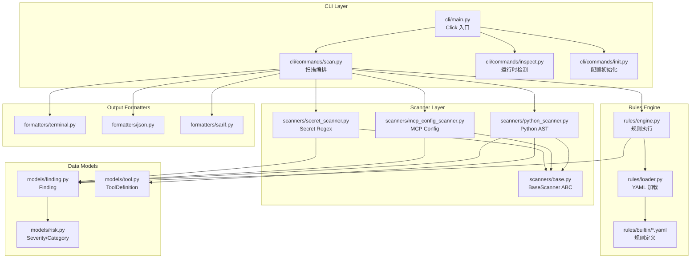

# agent-audit 架构文档

> **版本:** v0.2.0 → v0.3.0 升级分析
> **日期:** 2026-02-03

---

## 1. 目录结构说明

```
agent-security-suite/
├── packages/audit/                    # 核心 Python 包（Poetry 管理）
│   ├── agent_audit/
│   │   ├── __init__.py               # 包入口，版本号定义
│   │   ├── version.py                # 版本号单独文件
│   │   ├── cli/                      # 命令行接口
│   │   │   ├── main.py              # Click CLI 入口，注册子命令
│   │   │   ├── commands/            # 子命令实现
│   │   │   │   ├── scan.py          # scan 命令：核心扫描流程编排
│   │   │   │   ├── inspect.py       # inspect 命令：MCP 运行时检测
│   │   │   │   └── init.py          # init 命令：初始化配置文件
│   │   │   └── formatters/          # 输出格式化器
│   │   │       ├── terminal.py      # 终端彩色输出（Rich）
│   │   │       ├── json.py          # JSON 输出
│   │   │       ├── sarif.py         # SARIF 2.1.0 格式
│   │   │       └── markdown.py      # Markdown 报告（内联于 scan.py）
│   │   ├── scanners/                 # 静态分析扫描器
│   │   │   ├── base.py              # BaseScanner 抽象基类
│   │   │   ├── python_scanner.py    # Python AST 扫描器（最复杂，1200+ 行）
│   │   │   ├── mcp_config_scanner.py # MCP 配置文件解析
│   │   │   └── secret_scanner.py    # 正则匹配硬编码密钥
│   │   ├── rules/                    # 规则引擎
│   │   │   ├── engine.py            # 规则执行引擎，模式匹配 → Finding
│   │   │   └── loader.py            # YAML 规则加载器
│   │   ├── models/                   # 数据模型
│   │   │   ├── finding.py           # Finding 数据类，OWASP 映射
│   │   │   ├── risk.py              # Severity/Category 枚举，Location
│   │   │   └── tool.py              # ToolDefinition 数据类
│   │   ├── config/                   # 配置管理
│   │   │   └── ignore.py            # .agent-audit.yaml 解析，忽略规则
│   │   └── utils/                    # 工具函数
│   │       ├── compat.py            # Python 版本兼容
│   │       └── mcp_client.py        # MCP 协议客户端（运行时检测）
│   ├── pyproject.toml               # Poetry 配置，依赖定义
│   └── dist/                         # 构建输出
├── rules/builtin/                     # 内置 YAML 规则定义
│   ├── owasp_agentic.yaml           # 原始规则 AGENT-001~005
│   └── owasp_agentic_v2.yaml        # 扩展规则 AGENT-010~025（OWASP ASI）
├── tests/                             # pytest 测试套件
│   ├── conftest.py                  # 共享 fixture 定义
│   ├── fixtures/                    # 测试用 vulnerable/safe 代码示例
│   │   ├── vulnerable_agents/       # 故意漏洞代码
│   │   ├── safe_agents/             # 安全代码
│   │   └── mcp_configs/             # MCP 配置示例
│   ├── test_scanners/               # Scanner 单元测试
│   ├── test_rules/                  # 规则引擎测试
│   ├── test_cli/                    # CLI 命令测试
│   └── test_owasp_agentic.py        # OWASP 覆盖验证测试
├── docs/                              # 文档（本文件所在）
├── specs/                             # 规格说明
├── .github/workflows/                 # CI/CD 配置
│   ├── ci.yml                       # 测试 + Lint
│   └── publish.yml                  # PyPI 发布
├── .agent-audit.yaml                  # 自身扫描配置
├── CLAUDE.md                          # Claude Code 项目指令
├── action.yml                         # GitHub Action 定义
└── README.md                          # 项目说明
```

---

## 2. 模块依赖图



---

## 3. 规则引擎工作流

```
┌─────────────────────────────────────────────────────────────────────────┐
│ CLI: agent-audit scan <target>                                          │
└───────────────────────────────────┬─────────────────────────────────────┘
                                    │
┌───────────────────────────────────▼─────────────────────────────────────┐
│ scan.py: run_scan()                                                     │
│ 1. 初始化 IgnoreManager (加载 .agent-audit.yaml)                          │
│ 2. 初始化三个 Scanner: PythonScanner, MCPConfigScanner, SecretScanner   │
│ 3. 初始化 RuleEngine (加载 rules/builtin/*.yaml)                         │
└───────────────────────────────────┬─────────────────────────────────────┘
                                    │
           ┌────────────────────────┼────────────────────────┐
           │                        │                        │
           ▼                        ▼                        ▼
┌──────────────────┐     ┌──────────────────┐     ┌──────────────────┐
│  PythonScanner   │     │ MCPConfigScanner │     │  SecretScanner   │
│  scan(path)      │     │  scan(path)      │     │  scan(path)      │
│                  │     │                  │     │                  │
│ - 遍历 .py 文件   │     │ - 遍历 .json/.yaml│     │ - 遍历文本文件    │
│ - AST 解析       │     │ - 检测 mcpServers │     │ - 正则匹配密钥    │
│ - 提取 tools     │     │ - 解析 server 配置│     │ - 过滤误报       │
│ - 检测危险模式   │     │                  │     │                  │
└────────┬─────────┘     └────────┬─────────┘     └────────┬─────────┘
         │                        │                        │
         │ PythonScanResult       │ MCPConfigScanResult    │ SecretScanResult
         │ - tools[]              │ - servers[]            │ - secrets[]
         │ - dangerous_patterns[] │ - config_type          │
         │                        │                        │
         └────────────────────────┼────────────────────────┘
                                  │
                                  ▼
┌─────────────────────────────────────────────────────────────────────────┐
│ RuleEngine                                                              │
│                                                                         │
│ evaluate_dangerous_patterns(patterns, file_path):                       │
│   - 匹配 PATTERN_TYPE_TO_RULE_MAP (e.g., 'shell_true' → 'AGENT-001')   │
│   - 创建 Finding 对象                                                   │
│                                                                         │
│ evaluate_mcp_config(servers, file_path):                                │
│   - 检查 unverified server → AGENT-005                                 │
│   - 检查 credentials in env → AGENT-004                                │
│                                                                         │
│ evaluate_permission_scope(tools, file_path):                            │
│   - 工具数 > 15 → AGENT-002                                            │
│   - 高风险组合 → AGENT-002                                             │
│                                                                         │
│ 返回: List[Finding]                                                     │
└───────────────────────────────────┬─────────────────────────────────────┘
                                    │
                                    ▼
┌─────────────────────────────────────────────────────────────────────────┐
│ scan.py: 后处理                                                          │
│ 1. IgnoreManager.apply_to_finding() → 设置 suppressed 标志              │
│ 2. filter_by_baseline() → 过滤已知问题                                  │
│ 3. 按 min_severity 过滤                                                 │
│ 4. 输出到 terminal/json/sarif/markdown                                  │
│ 5. 根据 fail_on 计算 exit_code                                          │
└─────────────────────────────────────────────────────────────────────────┘
```

---

## 4. 已有规则清单

### 4.1 原始规则 (owasp_agentic.yaml)

| Rule ID | Title | Severity | Category | CWE | OWASP |
|---------|-------|----------|----------|-----|-------|
| AGENT-001 | Command Injection via Unsanitized Input | CRITICAL | command_injection | CWE-78 | OWASP-AGENT-02 |
| AGENT-002 | Excessive Agent Permissions | MEDIUM | excessive_permission | CWE-250 | OWASP-AGENT-01 |
| AGENT-003 | Potential Data Exfiltration Chain | HIGH | data_exfiltration | CWE-200 | OWASP-AGENT-05 |
| AGENT-004 | Hardcoded Credentials in Agent Config | CRITICAL | credential_exposure | CWE-798 | OWASP-AGENT-03 |
| AGENT-005 | Unverified MCP Server | HIGH | supply_chain | CWE-494 | OWASP-AGENT-04 |

### 4.2 OWASP Agentic Top 10 扩展规则 (owasp_agentic_v2.yaml)

| Rule ID | Title | Severity | ASI | Category |
|---------|-------|----------|-----|----------|
| AGENT-010 | System Prompt Injection Vector | CRITICAL | ASI-01 | goal_hijack |
| AGENT-011 | Missing Goal Validation | HIGH | ASI-01 | goal_hijack |
| AGENT-013 | Agent with Long-Lived Credentials | HIGH | ASI-03 | identity_privilege_abuse |
| AGENT-014 | Overly Permissive Agent Role | HIGH | ASI-03 | identity_privilege_abuse |
| AGENT-015 | Untrusted MCP Server Source | CRITICAL | ASI-04 | supply_chain_agentic |
| AGENT-016 | Unvalidated RAG Data Source | HIGH | ASI-04 | supply_chain_agentic |
| AGENT-017 | Unsandboxed Code Execution | CRITICAL | ASI-05 | unexpected_code_execution |
| AGENT-018 | Unsanitized Input to Persistent Memory | CRITICAL | ASI-06 | memory_poisoning |
| AGENT-019 | Conversation History Without Integrity | MEDIUM | ASI-06 | memory_poisoning |
| AGENT-020 | Unencrypted Inter-Agent Channel | HIGH | ASI-07 | insecure_inter_agent_comm |
| AGENT-021 | Missing Circuit Breaker | HIGH | ASI-08 | cascading_failures |
| AGENT-022 | No Error Handling in Tool | MEDIUM | ASI-08 | cascading_failures |
| AGENT-023 | Agent Output Without Transparency | MEDIUM | ASI-09 | trust_exploitation |
| AGENT-024 | Agent Without Kill Switch | CRITICAL | ASI-10 | rogue_agent |
| AGENT-025 | Agent Without Behavioral Monitoring | HIGH | ASI-10 | rogue_agent |

### 4.3 OWASP 覆盖状态

| ASI | 名称 | 当前覆盖 | 规则 |
|-----|------|---------|------|
| ASI-01 | Agent Goal Hijack | ✅ | AGENT-010, AGENT-011 |
| ASI-02 | Tool Misuse | ❌ | **未覆盖** |
| ASI-03 | Identity & Privilege Abuse | ✅ | AGENT-013, AGENT-014 |
| ASI-04 | Supply Chain | ✅ | AGENT-015, AGENT-016 |
| ASI-05 | Unexpected Code Execution | ✅ | AGENT-017 |
| ASI-06 | Memory Poisoning | ✅ | AGENT-018, AGENT-019 |
| ASI-07 | Insecure Inter-Agent Comm | ✅ | AGENT-020 |
| ASI-08 | Cascading Failures | ✅ | AGENT-021, AGENT-022 |
| ASI-09 | Human-Agent Trust | ⚠️ | AGENT-023 (仅 opaque output) |
| ASI-10 | Rogue Agents | ✅ | AGENT-024, AGENT-025 |

**当前覆盖: 8/10** — 缺失 ASI-02 (Tool Misuse)，ASI-09 覆盖不完整。

---

## 5. 关键接口

### 5.1 Scanner 基类

```python
# scanners/base.py
from abc import ABC, abstractmethod
from pathlib import Path
from typing import Sequence

@dataclass
class ScanResult:
    source_file: str
    metadata: Dict[str, Any] = field(default_factory=dict)

class BaseScanner(ABC):
    name: str = "BaseScanner"

    @abstractmethod
    def scan(self, path: Path) -> Sequence[ScanResult]:
        """返回 Sequence 而非 List，支持子类返回协变类型"""
        pass
```

### 5.2 Finding 数据结构

```python
# models/finding.py
@dataclass
class Finding:
    rule_id: str                      # "AGENT-001"
    title: str
    description: str
    severity: Severity                # CRITICAL/HIGH/MEDIUM/LOW/INFO
    category: Category                # 枚举值
    location: Location                # file_path, start_line, snippet

    # v0.2.0 新增
    confidence: float = 1.0           # 0.0-1.0 置信度
    suppressed: bool = False          # 是否被忽略配置抑制
    suppressed_reason: Optional[str]
    suppressed_by: Optional[str]

    cwe_id: Optional[str]
    owasp_id: Optional[str]           # ASI-XX
    remediation: Optional[Remediation]
    metadata: Dict[str, Any]

    def is_actionable(self, min_confidence=0.5) -> bool:
        """非抑制且置信度达标"""

    def to_sarif() -> Dict[str, Any]:
        """SARIF 2.1.0 格式"""

    def to_dict() -> Dict[str, Any]:
        """JSON 序列化"""
```

### 5.3 规则 YAML Schema

```yaml
rules:
  - id: AGENT-XXX                # 必填：规则 ID
    title: "Short Title"         # 必填：简短标题
    description: |               # 可选：详细描述
      Multi-line description.
    severity: critical           # 必填：critical/high/medium/low/info
    category: goal_hijack        # 必填：Category 枚举值
    owasp_agentic_id: "ASI-01"   # 可选：OWASP Agentic ID
    cwe_id: "CWE-77"             # 可选：CWE ID

    detection:                   # 检测配置
      type: ast                  # ast/config/regex/composite
      patterns:
        - pattern_type: "function_arg_fstring"
          function_names: [...]
          # 具体字段因 pattern_type 而异

    remediation:                 # 修复建议
      description: |
        How to fix this issue.
      code_example: |
        # Good practice example
      references:
        - "https://..."
```

---

## 6. 优化切入点

### 6.1 MCP 配置扫描器 [ISSUE-2]

**当前位置:** `scanners/mcp_config_scanner.py`

**现状:**
- 仅检测 `mcpServers`/`servers` 结构
- `_is_verified_source()` 仅检查 trusted_sources 前缀
- 缺少对 args 路径参数、env 敏感变量、transport 认证的检测

**扩展点:**
- 新增 `check_filesystem_access()` → AGENT-029 (已有方法，未集成到规则)
- 新增 `get_dangerous_env_vars()` → AGENT-031 (已有方法，未集成到规则)
- 新增 `_check_unverified_source()` → AGENT-030 (npx 版本检查)
- 新增 `_check_missing_auth()` → AGENT-033 (SSE/HTTP 认证)

### 6.2 Python AST 扫描器 [ISSUE-1]

**当前位置:** `scanners/python_scanner.py`

**现状:**
- `AGENT_CONSTRUCTORS` 已包含 `AgentExecutor`, `create_react_agent` 等
- `_check_missing_circuit_breaker()` 检查 max_iterations 但仅用于 AGENT-021
- 缺少 LangChain 特定的更细粒度检测

**扩展点:**
- 新增 AGENT-025 检测：AgentExecutor 缺少 max_iterations/max_execution_time/handle_parsing_errors
- 新增 AGENT-026 检测：@tool 函数参数直接传入危险函数
- 新增 AGENT-027 检测：SystemMessage content 参数为 f-string

### 6.3 AGENT-018 误报抑制 [ISSUE-3]

**当前位置:** `python_scanner.py` → `_check_memory_poisoning()`

**现状:**
- 任何 `MEMORY_WRITE_FUNCTIONS` + 变量参数 → 触发
- 无框架白名单过滤
- 无数据流分析

**扩展点:**
- 新增 `rules/allowlists/framework_memory.yaml` 框架白名单
- 新增 `context_analyzer.py` 上下文分析模块
- 修改 `_check_memory_poisoning()` 加入三级过滤

### 6.4 ASI-02 / ASI-09 覆盖 [ISSUE-4]

**ASI-02 Tool Misuse:**
- 当前无专门规则
- 扩展点：新增 AGENT-034/035/036 检测 tool 输入验证、执行、输出

**ASI-09 Human-Agent Trust:**
- 当前仅 AGENT-023 (opaque output)
- 扩展点：新增 AGENT-037/038/039 检测 human-in-loop、冒充、信任边界

---

## 7. 测试现状

```
tests/
├── 测试文件数: 26
├── 覆盖的模块:
│   ├── scanners/: test_python_scanner.py, test_mcp_scanner.py,
│   │              test_config_scanner.py, test_secret_scanner.py
│   ├── rules/: test_engine.py
│   ├── models/: test_finding.py
│   ├── cli/: test_scan_command.py, test_formatters.py
│   ├── config/: test_ignore.py
│   └── utils/: test_compat.py, test_mcp_client.py
└── 特殊测试:
    └── test_owasp_agentic.py: OWASP ASI 覆盖验证
```

**运行命令:**
```bash
cd packages/audit
poetry run pytest ../../tests/ -v --cov=agent_audit
```
